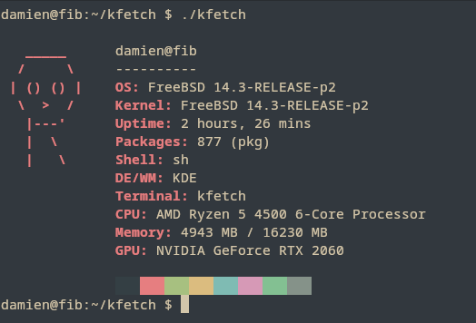

`kfetch` is a lightweight, cross-platform system information fetcher for BSD and Linux.

## Features
- [x] Detects OS, Kernel, Uptime, Packages, Shell, DE/WM, CPU, Memory, GPU
- [x] Works on FreeBSD, Linux, and other BSDs
- [x] Clean, minimal ASCII art for 30+ systems
- [x] Optional ANSI color customization
- [x] Command-line flags to toggle output
- [x] Supported config files

## Installation

Clone the repo:

```sh
git clone https://github.com/0x16000/kfetch.git
cd kfetch
```

Build it:

```sh
make
```

Optional: Install kfetch onto your system

```sh
make install
```

## Usage

```sh
./kfetch [options]
```

## Flags

| Flag             | Description                  |
| ---------------- | ---------------------------- |
| `--output`       | Enable verbose config output |
| `--no-art`       | Hide ASCII art               |
| `--no-colors`    | Disable colors               |
| `--no-username`  | Hide username                |
| `--no-hostname`  | Hide hostname                |
| `--no-os`        | Hide OS info                 |
| `--no-kernel`    | Hide kernel info             |
| `--no-uptime`    | Hide uptime                  |
| `--no-packages`  | Hide package count           |
| `--no-shell`     | Hide shell info              |
| `--no-de`        | Hide desktop environment     |
| `--no-terminal`  | Hide terminal info           |
| `--no-cpu`       | Hide CPU info                |
| `--no-memory`    | Hide memory info             |
| `--help` or `-h` | Show help                    |


## Configuration

Edit the config file at `/.config/kfetch.conf` after `make install` to customize your output. Example:

```ini
show_art = true
show_colors = true
show_username = true
custom_art_color = bright_blue
custom_text_color = bright_green
```

Use the `--output` flag to see verbose config parsing messages.

## Screenshots



## Contributing


*   Pull requests and issues are welcome!

*   Follow BSD/Linux standards

*   Keep it minimal

*   Use ANSI color codes carefully
